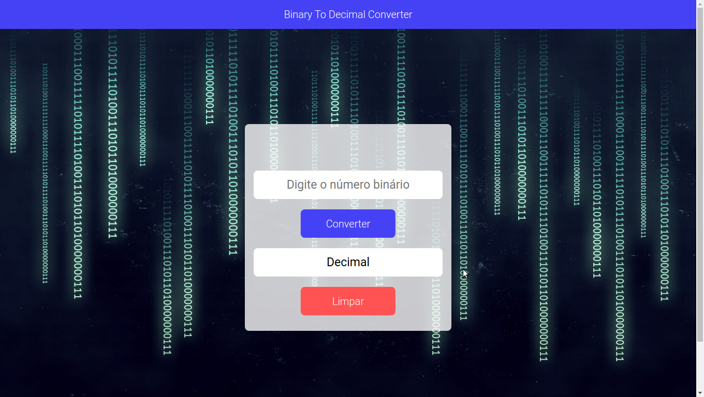

# BinToDec

;

### Descrição

BinToDec é uma aplicação para converter números binários em números decimais!
Desafio proposto no repositorio do **florinpop17** / **app-ideas**:

[Bin2Dec](https://github.com/florinpop17/app-ideas/blob/master/Projects/1-Beginner/Bin2Dec-App.md)

Neste repositório você irá encontrar muitos desafios para praticar seus aprendizados e se desenvolver como programador.

### As tecnologias usadas para completar este desafio foram:

* HTML
* CSS3
* JavaSript

### A IDE utiliada foi:

* Visual Studio Code